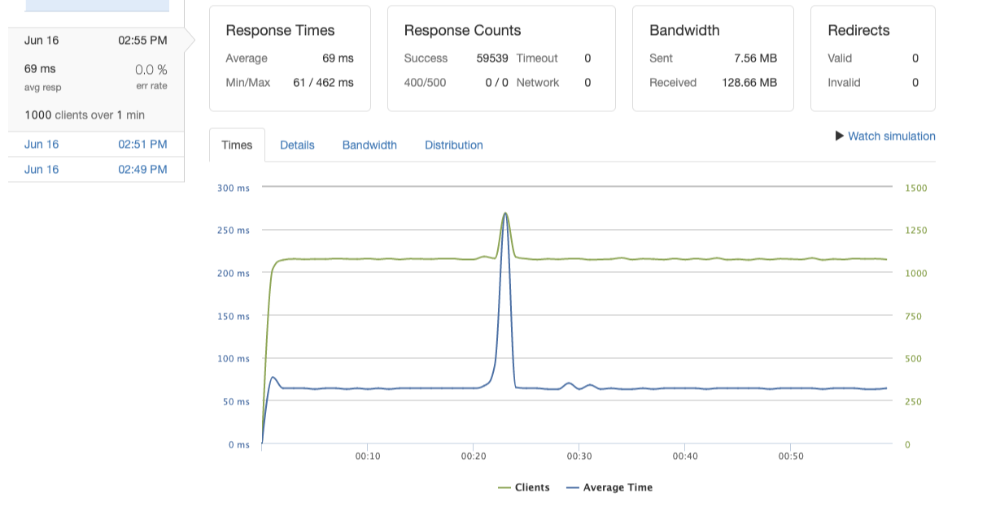

# Ratings and Reviews

## Overview
Back-end ratings and reviews service for an e-commerce application. 

## Table of Contents
- [Description](#description)
- [Installation](#installation-and-setup)
- [Technologies](#technologies)
- [Contributor](#contributor)

## Description
Created a database and server and designed a back-end system scaled to meet the demands of production traffic. It was tested with k6 in development and Loader.io after deployment. The service was deployed on Amazon Web Services and horizontally scaled with a load balancer and 3 servers and achieved latency of 66ms, throughput of over 1000rps, and a 0% error rate. 



---

## Installation and Setup
1. Fork and clone the repo and navigate to the root directory.

2. To install dependencies:
```
npm install
```

---

## Technologies
- [PostgreSQL](https://www.postgresql.org/docs/)
- [AWS](https://docs.aws.amazon.com/)
- [NGINX](https://nginx.org/en/docs/)
- [k6](https://k6.io/docs/)
- [Loader.io](https://docs.loader.io/)

---

### Contributor
- [Jessica Zhou](https://github.com/jessicazhou86)
